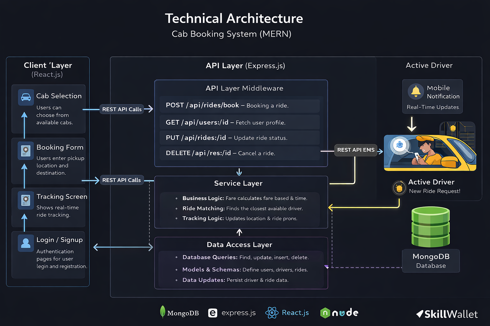
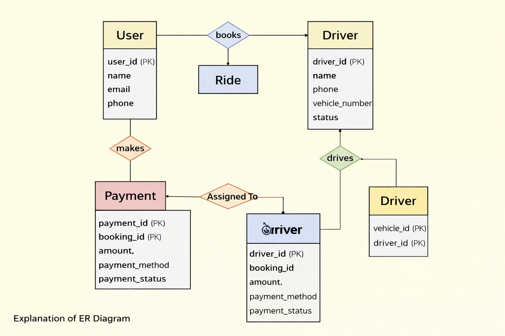
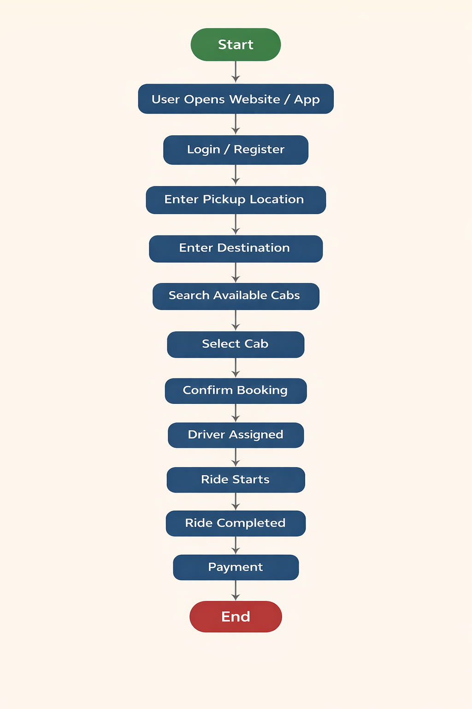

# 🚖 Cab Booking System (MERN Stack)

A web-based **Cab Booking System** built using the MERN stack (**MongoDB, Express.js, React.js, Node.js**).  
The system allows users to book rides, drivers to accept ride requests, and administrators to manage the platform.

---

# 📌 Project Overview

The Cab Booking System connects passengers with nearby drivers.  
Users can book rides, track them in real-time, and make payments through the platform.

This project demonstrates:

- MERN Stack Architecture
- Database design using MongoDB
- REST API development
- Full-stack application workflow

---

# 🛠 Tech Stack

### Frontend
- React.js
- HTML
- CSS
- JavaScript

### Backend
- Node.js
- Express.js

### Database
- MongoDB
- Mongoose ODM

### Tools
- GitHub
- VS Code
- Draw.io (for diagrams)

---

# 🏗 System Architecture



The system follows a layered architecture:

1. **Client Layer (React.js)** – User interface and interactions  
2. **API Layer (Express.js)** – Handles REST API requests  
3. **Service Layer** – Business logic like ride matching and fare calculation  
4. **Data Access Layer (MongoDB)** – Stores users, drivers, rides, and payments  

---

# 🗄 ER Diagram



### Relationships

### User – Ride
**Type:** One-to-Many  

**Meaning:**  
One user can book multiple rides, but each ride is linked to only one user.

---

### Ride – Driver
**Type:** Many-to-One  

**Meaning:**  
Multiple rides can be assigned to a single driver, but each ride has only one driver.

---

### Driver – Vehicle
**Type:** One-to-One / One-to-Many  

**Meaning:**  
A driver typically uses one vehicle, but vehicles can be shared across driver shifts.

---

# 🔄 User Flow



### Booking Process

1. User opens the application  
2. User logs in or registers  
3. User enters pickup and destination  
4. System shows available cabs  
5. User selects a cab  
6. Booking is confirmed  
7. Driver is assigned  
8. Ride begins and can be tracked  
9. Ride completes  
10. User makes payment  

---

# ⭐ Features

## User Features
- User registration and login
- Book a cab
- View available drivers
- Real-time ride tracking
- Secure payment system
- Booking history

---

## Driver Features
- Accept ride requests
- View ride details
- Start and complete rides
- Update ride status

---

## Admin Features
- Manage users and drivers
- Monitor ride bookings
- Manage system data
- View analytics and reports

---

# 🧩 MVC Architecture

The project follows the **Model–View–Controller (MVC)** pattern.

## Model
Handles database structure using MongoDB schemas.

Example models:
- User Model
- Driver Model
- Ride Model
- Booking Model
- Payment Model

---

## View
Frontend developed using **React.js**.

Example pages:
- Login Page
- Registration Page
- Cab Booking Page
- Ride Tracking Page
- Payment Page
- Booking History Page

---

## Controller
Handles API logic and connects the frontend with the database.

Example controllers:
- User Controller
- Driver Controller
- Ride Controller
- Booking Controller
- Payment Controller

---

## 📂 Project Structure

```
Cab-Booking
│
├── docs
│   ├── technical-architecture.md
│   ├── er-diagram.md
│   ├── user-flow.md
│   ├── roles-responsibilities.md
│   ├── features.md
│   └── mvc-pattern.md
│
├── images
│   ├── architecture-diagram.png
│   ├── er-diagram.png
│   └── user-flow.png
│
├── frontend
├── backend
│
└── README.md
```

---

# 🎥 Demo

Project Demo Video and Files:

[View Demo on Google Drive](https://drive.google.com/drive/folders/1iGj48dTgnWA1f1eFiCJfJGxZvStpNk7j?usp=sharing)

---

## 👨‍💻 Contributors

Group Project – MERN Stack Development

- Project Architecture
- Backend Development
- Frontend Development
- Database Design

---

# 📜 License

This project is developed for educational purposes as part of the **SkillWallet MERN Stack Course**.